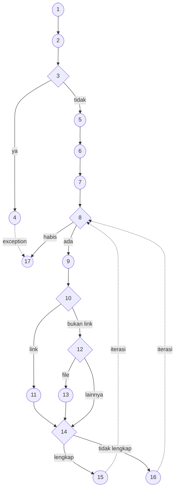

# Pengujian Unit — White Box Testing

Dokumen ini menyediakan bahan siap pakai untuk sub-bab **Pengujian Unit (Unit Testing)**
pada laporan. Struktur penomoran mengikuti kerangka laporan (5.4.1.1 – 5.4.1.5) sehingga
isinya dapat dipindahkan langsung dengan penyesuaian nomor bab, gambar, dan tabel.

| | |
|---|---|
| Objek uji utama | `createPaperWithArtifacts()` — proses unggah paper beserta artefak |
| Lokasi kode sumber | [`src/services/paper.service.js:112`](../src/services/paper.service.js) |
| Berkas skrip uji | [`tests/unit/m04-paper-upload.test.js`](unit/m04-paper-upload.test.js) |
| Berkas CFG | [`tests/cfg-upload-paper.puml`](cfg-upload-paper.puml) |
| Cyclomatic Complexity | **V(G) = 6** |
| Jumlah skenario uji | 6 (satu skenario untuk setiap jalur independen) |
| Hasil | Seluruh skenario **PASS** |

---

## 5.4.1 Pengujian Unit (Unit Testing)

Pengujian Unit dilakukan untuk memastikan bahwa proses utama pada backend dapat berjalan
sesuai dengan logika yang telah dirancang. Pengujian ini menggunakan pendekatan **White Box
Testing** dengan menganalisis alur logika pada proses unggah paper beserta artefak
pendukungnya. Pengujian difokuskan pada proses yang memiliki beberapa kondisi dan
percabangan, meliputi validasi keberadaan berkas paper, normalisasi metadata (penulis, kata
kunci, kategori, dan tanggal publikasi), rekonstruksi data artefak dari request body,
penentuan sumber artefak (tautan atau berkas), serta penjagaan kelengkapan data artefak
sebelum disimpan. Sementara itu, pengujian pada antarmuka aplikasi web dilakukan melalui
pengujian fungsional menggunakan metode Black Box Testing.

Untuk mengetahui tingkat kompleksitas proses yang diuji, dilakukan pemodelan **Control Flow
Graph (CFG)**, perhitungan **Cyclomatic Complexity**, penentuan jalur independen (**Basis
Path**), serta pengujian terhadap setiap jalur yang telah ditentukan.

Proses ini dipilih sebagai objek pengujian White Box karena merupakan proses inti sistem dan
memiliki percabangan terbanyak di antara seluruh proses backend. Proses tersebut juga
bersesuaian langsung dengan pemodelan *sequence diagram* “Upload Paper” dan “Upload
Artefak” yang telah dirancang pada bab sebelumnya.

---

## 5.4.1.1 Abstraksi Logika dan Pseudocode

Tahap awal pengujian White Box dilakukan dengan menyederhanakan alur proses unggah paper ke
dalam bentuk pseudocode. Proses yang dianalisis mencakup validasi berkas paper, normalisasi
metadata, penyimpanan dokumen paper, pemrosesan setiap artefak pendukung, hingga pengembalian
respons. Pemodelan dalam bentuk pseudocode digunakan untuk mempermudah penggambaran alur
proses ke dalam Control Flow Graph (CFG). Adapun pseudocode proses unggah paper dan artefak
seperti di bawah ini.

```
1  BEGIN
2      input = Terima_Param(p_body, p_files, p_user)
3      v_paper_file = Cari_Berkas(p_files, "paperFile")
4      IF v_paper_file NOT FOUND THEN
5          RETURN Error_Exception("Paper file is required.")
6      ELSE
7          v_paper_data.owner      = p_user.id
8          v_paper_data.authors    = Pecah_Koma(p_body.authors)
9          v_paper_data.keywords   = Pecah_Koma(p_body.keywords)
10         v_paper_data.categories = Pecah_Koma(p_body.categories)
11         v_paper_data.isPublic   = (p_body.isPublic == "true")
12         v_paper_data.file       = Metadata_Berkas(v_paper_file)
13         v_saved_paper   = Simpan_Paper(v_paper_data)
14         v_artifact_list = Rekonstruksi_Artefak(p_body)
15         v_created       = []
16         FOR EACH v_item IN v_artifact_list DO
17             v_payload = { paper: v_saved_paper.id, type: v_item.type,
18                           name: v_item.name, sourceType: v_item.sourceType }
19             IF v_item.sourceType == "link" THEN
20                 v_payload.url = Normalisasi_Url(v_item.value)
21             ELSE IF v_item.sourceType == "file" THEN
22                 v_payload.file = Metadata_Berkas_Artefak(p_files, v_item.index)
23             ENDIF
24             IF (v_payload.sourceType == "link" AND v_payload.url) OR
25                (v_payload.sourceType == "file" AND v_payload.file) THEN
26                 v_created.ADD(Simpan_Artefak(v_payload))
27             ELSE
28                 Lewati_Artefak(v_item)
29             ENDIF
30         ENDFOR
31         RETURN Success_201_JSON(v_saved_paper, v_created)
32     ENDIF
33 END
```

**Catatan abstraksi.** Empat operasi disederhanakan agar CFG berfokus pada percabangan inti
proses unggah:

- **Penguraian tanggal publikasi** diabstraksikan sebagai bagian dari penyusunan data paper
  (baris 7–12). Logika penguraiannya memiliki CFG tersendiri dan telah diuji terpisah sebagai
  Modul M3 (`parseFlexibleDate`) pada pengujian pendukung.
- **Pemuatan relasi pemilik** (`populate`) diabstraksikan sebagai bagian dari penyusunan
  respons pada baris 31, karena operasi tersebut tidak memuat percabangan.
- **Pencarian berkas artefak** beserta pemeriksaan keberadaannya diabstraksikan menjadi satu
  operasi `Metadata_Berkas_Artefak()` pada baris 22, yang menghasilkan metadata berkas apabila
  ditemukan atau nilai kosong apabila tidak. Kondisi berkas tidak ditemukan tetap tertangkap
  pada keputusan kelengkapan data di baris 24.
- **Pemeriksaan ketersediaan `type` dan `sourceType`** diabstraksikan karena kondisinya
  tumpang tindih dengan keputusan kelengkapan data di baris 24, dan kedua cabang gagalnya
  bermuara pada tindakan yang sama, yaitu melewati artefak. Rinciannya dibahas pada
  Temuan T-07.

---

## 5.4.1.2 Pemodelan Control Flow Graph (CFG)

Setelah alur proses direpresentasikan dalam bentuk pseudocode, langkah berikutnya adalah
memodelkannya ke dalam Control Flow Graph (CFG). CFG digunakan untuk menggambarkan urutan
proses dan percabangan yang terjadi selama proses unggah paper dan artefak berlangsung.
Setiap node menunjukkan suatu proses atau keputusan, sedangkan hubungan antar-node
menunjukkan alur eksekusi proses.

> **Gambar 5.x** Control Flow Graph Proses Unggah Paper dan Artefak
>
> Berkas sumber diagram tersedia pada [`tests/cfg-upload-paper.puml`](cfg-upload-paper.puml)
> (format PlantUML/DOT, render dengan Graphviz). Diagram Mermaid di bawah dapat dipakai
> sebagai alternatif tanpa instalasi — tempel ke <https://mermaid.live> lalu ekspor PNG.



**Tabel 5.x** Keterangan Control Flow Graph

| Node | Keterangan |
|:---:|---|
| 1 | Menerima parameter request (body, files, user) dan mengekstrak metadata paper. |
| 2 | Mencari berkas dengan *fieldname* `paperFile` pada daftar berkas unggahan. |
| 3 | **Keputusan:** Apakah berkas paper tidak ditemukan? |
| 4 | Menampilkan kesalahan karena berkas paper wajib dilampirkan. |
| 5 | Menyusun data paper: normalisasi penulis, kata kunci, kategori, dan konversi status publik. |
| 6 | Menyimpan dokumen paper ke basis data. |
| 7 | Merekonstruksi daftar data artefak dari request body dan menyiapkan penampung hasil. |
| 8 | **Keputusan:** Apakah masih ada data artefak yang belum diproses? |
| 9 | Menyusun payload artefak awal (paper, tipe, nama, dan jenis sumber). |
| 10 | **Keputusan:** Apakah jenis sumber artefak berupa tautan (*link*)? |
| 11 | Menormalkan URL artefak dan menetapkannya pada payload. |
| 12 | **Keputusan:** Apakah jenis sumber artefak berupa berkas (*file*)? |
| 13 | Menetapkan metadata berkas artefak pada payload. |
| 14 | **Keputusan:** Apakah data artefak lengkap (tautan memiliki URL atau berkas memiliki file)? |
| 15 | Menyimpan dokumen artefak dan menambahkannya ke daftar hasil. |
| 16 | Melewati artefak karena data tidak lengkap. |
| 17 | Mengembalikan hasil proses dan menyelesaikan eksekusi. |

---

## 5.4.1.3 Perhitungan Cyclomatic Complexity

Perhitungan Cyclomatic Complexity dilakukan untuk mengetahui tingkat kompleksitas proses dan
menentukan jumlah minimum jalur independen yang perlu diuji. Perhitungan menggunakan jumlah
*Predicate node* atau titik keputusan pada alur proses dengan rumus:

```
V(G) = P + 1                                                    (1)
```

Pada proses yang diuji terdapat **lima** *Predicate node*, yaitu keputusan pada Node 3,
Node 8, Node 10, Node 12, dan Node 14. Dengan demikian, perhitungannya adalah:

```
V(G) = 5 + 1 = 6                                                (2)
```

Sebagai validasi, perhitungan juga dilakukan dengan dua rumus alternatif. Jumlah *edge* pada
CFG adalah **E = 21** dan jumlah *node* adalah **N = 17**, sehingga:

```
V(G) = E - N + 2 = 21 - 17 + 2 = 6                              (3)
V(G) = jumlah region = 6                                        (4)
```

Berdasarkan ketiga perhitungan tersebut, nilai Cyclomatic Complexity yang diperoleh adalah
**6** dan saling konsisten. Nilai tersebut menunjukkan bahwa terdapat minimal 6 jalur
independen yang perlu diuji untuk mencakup seluruh percabangan utama pada proses unggah paper
dan artefak.

---

## 5.4.1.4 Definisi Jalur Independen (Basis Path)

Berdasarkan hasil perhitungan Cyclomatic Complexity, ditentukan enam jalur independen yang
mewakili kondisi berbeda dalam proses unggah paper dan artefak, yaitu:

1. **Path 1:** 1 → 2 → 3 → 4 → 17
   — berkas paper tidak dilampirkan, proses dibatalkan pada Node 3.
2. **Path 2:** 1 → 2 → 3 → 5 → 6 → 7 → 8 → 17
   — tidak ada artefak, perulangan tidak pernah dimasuki (Node 8 bernilai salah).
3. **Path 3:** 1 → … → 8 → 9 → 10 → 11 → 14 → 15 → 8 → 17
   — artefak bertipe tautan dengan URL terisi, lolos Node 14 dan tersimpan.
4. **Path 4:** 1 → … → 8 → 9 → 10 → 11 → 14 → 16 → 8 → 17
   — artefak bertipe tautan tanpa URL, gugur pada Node 14.
5. **Path 5:** 1 → … → 8 → 9 → 10 → 12 → 13 → 14 → 15 → 8 → 17
   — artefak bertipe berkas dengan berkas terlampir, lolos Node 14 dan tersimpan.
6. **Path 6:** 1 → … → 8 → 9 → 10 → 12 → 14 → 16 → 8 → 17
   — jenis sumber bukan tautan maupun berkas, gugur pada Node 14.

Perlu dicatat bahwa Path 4 dan Path 6 sama-sama berakhir pada Node 14 yang bernilai salah,
demikian pula Path 3 dan Path 5 yang sama-sama bernilai benar. Yang membedakan keempatnya
bukan hasil keputusan pada Node 14, melainkan **cabang mana yang dilalui sebelum mencapainya**,
yaitu edge `11 → 14` untuk jalur tautan, `13 → 14` untuk jalur berkas, dan `12 → 14` untuk
jenis sumber yang tidak dikenali. Karena itu penamaan setiap jalur merujuk pada kondisi
masukan yang membangkitkannya, bukan pada keputusan terakhir yang dilaluinya.

Keterangan: notasi “1 → …” pada Path 3 sampai Path 6 merepresentasikan segmen awal
`1 → 2 → 3 → 5 → 6 → 7` yang identik pada seluruh jalur tersebut.

Keenam jalur di atas telah mencakup seluruh 21 *edge* pada CFG, dan masing-masing diwakili
tepat oleh satu skenario uji pada sub-bab berikutnya.

---

## 5.4.1.5 Implementasi dan Hasil Pengujian

Pengujian Unit diimplementasikan dengan membuat berkas skrip pengujian berbasis *native test
runner* Node.js (`node:test` & `node:assert`) tanpa menambahkan pustaka pihak ketiga. Skrip
menguji secara terisolasi **fungsi `createPaperWithArtifacts()` yang sebenarnya** pada kode
sumber, sesuai dengan alur percabangan yang dipetakan pada Basis Path.

Isolasi terhadap dependensi eksternal dilakukan dengan mengganti operasi persistensi pada
*prototype* Mongoose Document (`Paper.prototype.save`, `Paper.prototype.populate`, dan
`Artifact.prototype.save`) menggunakan *test double*, lalu memulihkannya kembali setelah setiap
skenario selesai. Dengan pendekatan ini pengujian tidak memerlukan koneksi MongoDB maupun
operasi tulis ke sistem berkas, namun logika yang dieksekusi tetap merupakan logika produksi
sehingga hasil pengujian merefleksikan perilaku sistem yang nyata.

Berikut adalah kutipan kode pengujian unit (*Unit Test Script*) yang menguji jalur-jalur
independen tersebut. Kode lengkap tersedia pada berkas
[`tests/unit/m04-paper-upload.test.js`](unit/m04-paper-upload.test.js).

```javascript
import test from 'node:test';
import assert from 'node:assert/strict';

import Paper from '../../src/models/Paper.js';
import Artifact from '../../src/models/Artifact.js';
import { createPaperWithArtifacts } from '../../src/services/paper.service.js';
import { createSandbox, fakeFile, fakeUser } from '../helpers/doubles.js';

/** Mengisolasi unit dari MongoDB dengan mengganti operasi persistensi. */
function setup() {
  const sandbox = createSandbox();
  sandbox.muteConsole();

  const artefakTersimpan = [];
  sandbox.patch(Paper.prototype, {
    save: async function () { return this; },
    populate: async function () { return this; },
  });
  sandbox.patch(Artifact.prototype, {
    save: async function () { artefakTersimpan.push(this); return this; },
  });

  return { sandbox, artefakTersimpan };
}

const bodyDasar = {
  title: 'Deteksi Anomali pada Jaringan Sensor',
  abstract: 'Penelitian ini membahas deteksi anomali.',
  authors: 'Akmal, Budi',
  keywords: 'anomali, sensor',
  categories: 'Jaringan, Machine Learning',
  isPublic: 'true',
};

const berkasPaper = () => fakeFile('paperFile', {
  path: 'uploads/papers/paperFile-1.pdf',
  mimetype: 'application/pdf',
  size: 204800,
});

test('Pengujian Unit Basis Path createPaperWithArtifacts', async (t) => {

  await t.test('Path 1 : berkas paper tidak dilampirkan', async () => {
    const { sandbox } = setup();
    await assert.rejects(
      () => createPaperWithArtifacts(bodyDasar, [fakeFile('artifacts[0][value]')], fakeUser()),
      /Paper file is required\./
    );
    sandbox.restoreAll();
  });

  await t.test('Path 2 : tanpa artefak', async () => {
    const { sandbox, artefakTersimpan } = setup();
    const user = fakeUser({ role: 'dosen' });
    const hasil = await createPaperWithArtifacts(
      { ...bodyDasar, publicationDate: '2025-03-17' },
      [berkasPaper()],
      user
    );
    assert.equal(hasil.owner.toString(), user._id.toString());
    assert.equal(hasil.isPublic, true);
    assert.deepEqual([...hasil.authors], ['Akmal', 'Budi']);
    assert.deepEqual([...hasil.keywords], ['anomali', 'sensor']);
    assert.equal(hasil.file.size, 204800);
    assert.equal(hasil.publicationDate.getUTCFullYear(), 2025);
    assert.equal(artefakTersimpan.length, 0);
    sandbox.restoreAll();
  });

  await t.test('Path 3 : artefak bertipe link tersimpan', async () => {
    const { sandbox, artefakTersimpan } = setup();
    await createPaperWithArtifacts(
      { ...bodyDasar, artifacts: [
        { type: 'source_code', name: 'Repositori', sourceType: 'link',
          value: 'github.com/akmal/repo' },
      ] },
      [berkasPaper()],
      fakeUser({ role: 'dosen' })
    );
    assert.equal(artefakTersimpan.length, 1);
    assert.equal(artefakTersimpan[0].url, 'https://github.com/akmal/repo');
    sandbox.restoreAll();
  });

  await t.test('Path 4 : artefak link tanpa URL dilewati', async () => {
    const { sandbox, artefakTersimpan } = setup();
    const hasil = await createPaperWithArtifacts(
      { ...bodyDasar, artifacts: [
        { type: 'source_code', name: 'Repositori', sourceType: 'link', value: '' },
      ] },
      [berkasPaper()],
      fakeUser({ role: 'dosen' })
    );
    assert.equal(artefakTersimpan.length, 0);
    assert.ok(hasil._id);   // paper tetap tersimpan
    sandbox.restoreAll();
  });

  await t.test('Path 5 : artefak bertipe file tersimpan', async () => {
    const { sandbox, artefakTersimpan } = setup();
    const berkasArtefak = fakeFile('artifacts[0][value]', {
      path: 'uploads/artifacts/artifacts0value-1.csv',
      mimetype: 'text/csv',
      size: 4096,
    });
    await createPaperWithArtifacts(
      { ...bodyDasar, artifacts: [
        { type: 'dataset', name: 'Data Latih', sourceType: 'file' },
      ] },
      [berkasPaper(), berkasArtefak],
      fakeUser({ role: 'dosen' })
    );
    assert.equal(artefakTersimpan.length, 1);
    assert.equal(artefakTersimpan[0].file.path,
                 'uploads/artifacts/artifacts0value-1.csv');
    sandbox.restoreAll();
  });

  await t.test('Path 6 : jenis sumber tidak dikenal dilewati', async () => {
    const { sandbox, artefakTersimpan } = setup();
    await createPaperWithArtifacts(
      { ...bodyDasar, artifacts: [
        { type: 'other', name: 'Catatan', sourceType: 'text', value: 'isi' },
      ] },
      [berkasPaper()],
      fakeUser({ role: 'dosen' })
    );
    assert.equal(artefakTersimpan.length, 0);
    sandbox.restoreAll();
  });
});
```

Skrip pengujian di atas kemudian dieksekusi secara terisolasi. Berikut adalah rekapitulasi
skenario beserta hasil ujinya.

**Tabel 5.x** Rekapitulasi Hasil Pengujian White Box

| Skenario Uji (Jalur) | Data Masukan (Input) | Hasil yang Diharapkan (Output) | Status |
|---|---|---|:---:|
| **Path 1:** Validasi Berkas Paper | `paperFile` tidak dilampirkan pada request | Proses dibatalkan & mengembalikan Exception *"Paper file is required."* Tidak ada dokumen yang tersimpan. | PASS |
| **Path 2:** Unggah Tanpa Artefak | `paperFile` = PDF 200 KB, `authors` = "Akmal, Budi", `isPublic` = "true", `publicationDate` = "2025-03-17" | Paper tersimpan; `authors` terpecah menjadi 2 elemen, `isPublic` = `true` (boolean), `publicationDate` = 2025. Daftar artefak kosong. API merespons status 201 Created. | PASS |
| **Path 3:** Artefak Tautan Valid | 1 artefak, `sourceType` = "link", `value` = "github.com/akmal/repo" | Artefak lolos Node 14 & tersimpan dengan `url` = `https://github.com/akmal/repo` (protokol ditambahkan otomatis), tanpa metadata berkas. API merespons status 201 Created. | PASS |
| **Path 4:** Artefak Tautan Tanpa URL | 1 artefak, `sourceType` = "link", `value` = "" | Artefak gugur pada Node 14 sehingga dilewati (0 artefak tersimpan), namun dokumen paper tetap tersimpan. API merespons status 201 Created. | PASS |
| **Path 5:** Artefak Berkas Terlampir | 1 artefak, `sourceType` = "file" + berkas CSV 4 KB pada field `artifacts[0][value]` | Artefak lolos Node 14 & tersimpan dengan metadata berkas lengkap (path, mimetype, size), `url` kosong. API merespons status 201 Created. | PASS |
| **Path 6:** Jenis Sumber Tidak Dikenal | 1 artefak, `sourceType` = "text" | Artefak gugur pada Node 14 sehingga dilewati (0 artefak tersimpan). API merespons status 201 Created. | PASS |

Keterangan: status HTTP pada kolom keluaran dihasilkan oleh lapisan *controller*
(`src/controllers/papers.controller.js`), yaitu `201 Created` untuk proses yang berhasil dan
`400 Bad Request` untuk Exception pada Path 1. Pengujian Unit ini memverifikasi keluaran pada
lapisan *service*, sedangkan pemetaan ke status HTTP diverifikasi melalui pengujian Black Box.

Sebagai bukti bahwa seluruh algoritma telah divalidasi dan berjalan sesuai dengan rancangan
Control Flow Graph, tangkapan layar terminal hasil eksekusi pengujian dapat diperoleh dengan
menjalankan perintah berikut pada direktori `backend`:

```bash
npm test
```

> **Gambar 5.x** Bukti Eksekusi Pengujian White Box

---

## Pengujian Unit Pendukung

Selain proses utama di atas, pengujian unit juga diterapkan pada dua belas unit lain di
lapisan *service* dan *middleware* untuk memperluas cakupan pengujian. Seluruh unit tersebut
diuji dengan pendekatan Basis Path yang sama dan dapat dijadikan lampiran laporan.
Perhitungan Cyclomatic Complexity beserta jumlah skenarionya dirangkum pada tabel berikut.

**Tabel 5.x** Rekapitulasi Pengujian Unit Pendukung

| Modul | Unit yang Diuji | Berkas Sumber | V(G) | Skenario | Status |
|:---:|---|---|:---:|:---:|:---:|
| M1 | `registerUser()` | `services/auth.service.js` | 2 | 2 | PASS |
| M2 | `loginUser()` | `services/auth.service.js` | 2 | 3 | PASS |
| M3 | `parseFlexibleDate()` | `services/paper.service.js` | 6 | 6 | PASS |
| M4 | `toArray()` | `services/paper.service.js` | 3 | 4 | PASS |
| M5 | `normalizeUrl()` | `services/paper.service.js` | 3 | 3 | PASS |
| M6 | `reconstructArtifacts()` | `services/paper.service.js` | 6 | 11 | PASS |
| **M7** | **`createPaperWithArtifacts()`** | `services/paper.service.js` | **6** | **6** | **PASS** |
| M8 | `deletePaper()` | `services/paper.service.js` | 6 | 7 | PASS |
| M9 | `createReadingList()` | `services/readingList.service.js` | 4 | 6 | PASS |
| M10 | `updateReadingList()` | `services/readingList.service.js` | 7 | 7 | PASS |
| M11 | `search()` | `services/search.service.js` | 5 | 7 | PASS |
| M12 | `errorHandler()` | `middlewares/error.js` | 5 | 6 | PASS |
| M13 | `requireRoles()` | `middlewares/rbac.js` | 2 | 4 | PASS |
| | **Total** | | **57** | **72** | **PASS** |

Pemilihan modul pendukung diselaraskan dengan pemodelan *sequence diagram* yang telah
dirancang: M6 dan M7 untuk “Upload Paper” dan “Upload Artefak”, M8 untuk “Hapus Paper”, serta
M9 dan M10 untuk “Create Reading List Public”.

Setiap berkas uji memuat catatan *header* berisi daftar *predicate node*, perhitungan V(G),
dan definisi jalur independen untuk unit yang bersangkutan, sehingga dapat dipakai langsung
sebagai bahan lampiran.

---

## Temuan Pengujian

Selain memverifikasi jalur yang benar, pengujian White Box juga menyingkap beberapa
anomali pada kode sumber. Temuan berikut **belum diperbaiki** dan tidak memengaruhi status
PASS pada tabel di atas, karena pengujian yang ada memverifikasi perilaku pada jalur yang
memang sudah benar.

### Temuan pada endpoint yang tidak terpakai (*dead code*)

Kedua temuan berikut merupakan cacat nyata pada kode, namun **tidak memengaruhi fitur yang
berjalan saat ini** karena endpoint yang bersangkutan tidak pernah dipanggil oleh frontend.
Kegagalan baru muncul apabila endpoint tersebut diakses langsung melalui klien API
(misalnya Postman) atau apabila frontend kelak diarahkan untuk memakainya.

**T-01 — Endpoint unggah BibTeX akan gagal apabila dipanggil.**
`src/controllers/papers.controller.js:17` memanggil `paperService.createPapersFromBib()`,
namun fungsi tersebut tidak pernah didefinisikan pada `src/services/paper.service.js`.
Akibatnya `POST /api/v1/papers/upload-bib` mengembalikan `400` dengan pesan
`paperService.createPapersFromBib is not a function`.

Fitur unggah `.bib` pada antarmuka **tetap berfungsi** karena tidak melewati endpoint ini:
berkas `.bib` diurai di sisi peramban menggunakan pustaka `@retorquere/bibtex-parser`
(`frontend/src/pages/UploadPaper.jsx:241`), hasilnya dipakai untuk mengisi formulir, lalu
setiap paper dikirim satu per satu ke `POST /api/v1/papers`
(`frontend/src/hooks/usePapers.js:50`). Dengan demikian endpoint `upload-bib` beserta
*controller*-nya merupakan sisa rancangan yang tidak terpakai.

**T-02 — Endpoint hapus artefak akan gagal apabila dipanggil.**
`src/services/artifact.service.js:84` memanggil `artifact.remove()`. Method
`Document.prototype.remove()` telah dihapus pada Mongoose 7 (versi terpasang: 7.8.7),
sehingga `DELETE /api/v1/papers/:paperId/artifacts/:id` akan mengembalikan `500`.
Perbaikannya sama dengan yang telah diterapkan pada reading list, yaitu mengganti
`remove()` menjadi `deleteOne()`.

Penghapusan artefak pada antarmuka **tetap berfungsi** karena ditangani melalui proses
pembaruan paper — `updatePaperWithArtifacts()` (`src/services/paper.service.js:204`) sudah
memakai `deleteOne()` pada baris 257. Penelusuran pada frontend tidak menemukan satu pun pemanggilan
menuju `src/routes/artifacts.routes.js`, sehingga seluruh sub-router artefak tersebut juga
merupakan kode yang tidak terpakai.

### Temuan menengah

**T-03 — Cabang strategi pencarian tidak dapat dicapai.**
`src/services/search.service.js:25` membaca `env.searchStrategy`, tetapi
`src/config/env.js` tidak pernah memetakan variabel `SEARCH_STRATEGY` dari `process.env`.
Nilainya selalu `undefined`, sehingga cabang `atlas` dan `text` menjadi kode mati dan sistem
selalu memakai strategi `regex`. Kedua cabang tersebut hanya dapat diuji dengan menyuntik
nilai konfigurasi secara langsung (lihat `tests/unit/m07-search.test.js`).

**T-04 — Semantik zona waktu `parseFlexibleDate()` tidak konsisten.**
Format `YYYY-MM-DD` diurai sebagai tengah malam **UTC**, sedangkan format `YYYY` diurai
sebagai tengah malam **waktu lokal**. Pada zona WIB (UTC+7), masukan `"2025"` tersimpan
sebagai `2024-12-31T17:00:00Z`, sehingga tahun publikasi dapat tampil sebagai 2024.
Perbaikannya adalah menambahkan penanda `Z` pada `paper.service.js:26`.

**T-05 — Tanggal kalender tidak valid diterima secara diam-diam.**
`parseFlexibleDate('2025-02-30')` tidak ditolak, melainkan digeser otomatis oleh JavaScript
menjadi `2025-03-02`. Masukan yang salah tersimpan sebagai tanggal yang salah, bukan ditolak.

**T-06 — Otorisasi pembaruan reading list tidak konsisten dan rawan *mass assignment*.**
`updateReadingList()` hanya mengizinkan pemilik, tanpa jalur khusus admin — berbeda dengan
`deletePaper()` dan `updatePaperWithArtifacts()` yang memberi admin kewenangan penuh. Selain
itu `Object.assign(readingList, listData)` pada `readingList.service.js:84` menyalin seluruh
isi request body ke dokumen, sehingga klien berpotensi mengubah field yang tidak semestinya
seperti `owner`.

**T-07 — Percabangan bersarang pada validasi artefak sebagian redundan.**
Pada `src/services/paper.service.js:182` terdapat dua `if` bersarang. Penjaga terluar
memeriksa `type && sourceType`, sedangkan penjaga di dalamnya memeriksa
`(sourceType === 'link' && url) || (sourceType === 'file' && file)`.

Pemeriksaan `sourceType` pada penjaga terluar bersifat redundan, karena kondisi di dalamnya
hanya dapat bernilai benar apabila `sourceType` telah bernilai `'link'` atau `'file'`.
Pemeriksaan `type` tidak redundan, sebab penjaga bagian dalam sama sekali tidak memeriksanya.
Kedua cabang gagal juga bermuara pada tindakan yang sama, yaitu melewati artefak. Dengan
demikian keduanya dapat digabung menjadi satu keputusan:

```javascript
if (type && ((sourceType === 'link' && url) || (sourceType === 'file' && file)))
```

Penggabungan tersebut menurunkan Cyclomatic Complexity unit ini dari 7 menjadi 6 tanpa
mengubah perilaku, dan menjadi dasar penyederhanaan pada pemodelan CFG (lihat Catatan
abstraksi pada sub-bab 5.4.1.1).

---

## Cara Menjalankan Pengujian

Pengujian tidak memerlukan koneksi MongoDB, berkas `.env`, maupun pustaka tambahan.

```bash
npm test
```

Menjalankan ulang secara otomatis setiap kali kode berubah:

```bash
npm run test:watch
```

Menjalankan satu modul saja:

```bash
node --test --test-reporter=spec tests/unit/m04-paper-upload.test.js
```

### Struktur Berkas Pengujian

```
backend/tests/
├── WHITEBOX-TESTING.md              dokumen ini
├── cfg-upload-paper.puml            Control Flow Graph modul utama
├── helpers/
│   └── doubles.js                   test double untuk isolasi MongoDB dan file system
└── unit/
    ├── m01-auth.test.js             M1  registerUser, M2 loginUser
    ├── m02-metadata.test.js         M3  parseFlexibleDate, M4 toArray, M5 normalizeUrl
    ├── m03-artifact-reconstruct.test.js
    │                                M6  reconstructArtifacts
    ├── m04-paper-upload.test.js     M7  createPaperWithArtifacts  <- modul utama
    ├── m05-paper-delete.test.js     M8  deletePaper
    ├── m06-readinglist.test.js      M9  createReadingList, M10 updateReadingList
    ├── m07-search.test.js           M11 search
    └── m08-error-rbac.test.js       M12 errorHandler, M13 requireRoles
```

### Catatan Perubahan pada Kode Sumber

Agar dapat diuji secara terisolasi, empat fungsi pembantu pada
`src/services/paper.service.js` diubah dari `const` menjadi `export const`:
`toArray`, `parseFlexibleDate`, `normalizeUrl`, dan `reconstructArtifacts`. Perubahan ini
hanya menambah ekspor dan tidak mengubah perilaku fungsi maupun pemakaiannya di dalam modul.
Tidak ada perubahan lain pada kode produksi.
